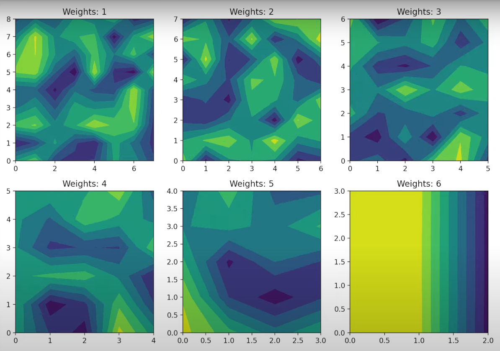

# Neural Network Visualizer




## Project Overview

This project aims to enhance my understanding of Artificial Neural Networks (ANN) while integrating visuals to complement the growing prominence of Large Language Models (LLMs). The goal is to present the fundamentals of LLMs in a visual format, making them more accessible and easier to understand.

The visualizer provides real-time contour plots of weight matrices as the neural network learns, offering an intuitive way to observe the learning process and weight adjustments during training.

## How It Works

### Neural Network Architecture

The implementation features a customizable feed-forward artificial neural network with:

- Configurable input and output layer sizes
- Adjustable number of training epochs
- Automatic layer structure generation between input and output dimensions
- Sigmoid activation function
- Gradient descent optimization

### Key Components

1. **ANN Class**: The core neural network implementation with the following methods:
   - `__init__`: Initializes the network with specified input/output dimensions and epochs
   - `build`: Constructs the network architecture with randomized initial weights
   - `sigmoid`: Implements the sigmoid activation function with optional derivative calculation
   - `__call__`: Handles forward propagation, backpropagation, and visualization updates

2. **Visualization System**:
   - Real-time contour plots showing weight matrices between layers
   - Dynamic updates during training to visualize the learning process
   - Color-coded visualization using the 'viridis' colormap to represent weight values

### Learning Process

The neural network learns through:

1. **Forward Propagation**: Input data flows through the network, with each layer applying weights and the sigmoid activation function
2. **Error Calculation**: The difference between predicted and actual outputs is computed
3. **Backpropagation**: Error gradients are calculated and propagated backward through the network
4. **Weight Updates**: Weights are adjusted based on the calculated gradients
5. **Visualization**: Weight matrices are visualized as contour plots after each training example

### Required Libraries

```bash
pip install numpy matplotlib
```

### Configuration Options

The neural network can be customized by adjusting the following parameters:

```python
# Create a neural network with:
# - 9 input neurons
# - 3 output neurons
# - 100 training epochs
ai = ANN(9, 3, epochs=100)
```

### Running the Visualizer

1. Clone this repository:
```bash
git clone https://github.com/yourusername/nnet-visuals.git
cd nnet-visuals
```

2. Run the neural network visualizer:
```bash
python nnet.py
```

3. The visualization window will appear showing contour plots of the weight matrices as the network trains.

### Customizing the Training Data

By default, the code uses random data for training. To use your own dataset:

```python
# Replace with your own data loading/generation
dataset = np.random.rand(rows, 9)  # Input data with 9 features
output = np.random.rand(rows, 3)   # Output data with 3 classes/values
```

### Extending the Visualization

The visualization system uses matplotlib subplots. You can modify the layout by changing:

```python
fig = plt.figure(figsize=(10, 7))
plots = [fig.add_subplot(2, 3, i) for i in range(1, 7)]
```

## Technical Details

### Weight Initialization

Weights are initialized with small random values to break symmetry:
```python
self.weights[i] = 0.05*np.random.rand(i, i-1)
```

### Activation Function

The network uses the sigmoid activation function:
```python
def sigmoid(self, x, derv=False):
    f = 1.0 / (1.0 + np.exp(-x))
    if derv:
        return f*(1 - f)
    return f
```

### Layer Structure

The network automatically creates a decreasing structure of layers from input to output size:
```python
self.axis = list(range(M, N, -1))
```
